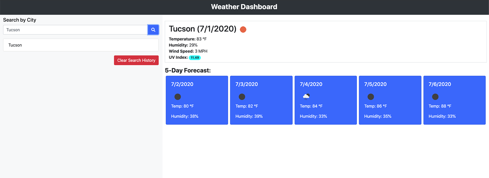
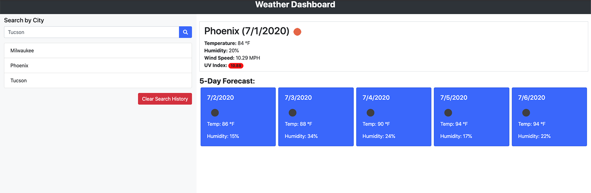

# Weather Dashboard

## Live URL
https://jakekelly44.github.io/weather-dashboard/

## Description
This is a Weather Dashboard webb application developed for the University of Arizona Coding Bootcamp Module #6. 

The user story is as follows;     
AS A traveler       
I WANT to see the weather outlook for multiple cities      
SO THAT I can plan a trip accordingly         

## Functionality 
The functionality is as follows;   

This is a weather dashboard with form inputs    
Users can search for a city    
Users can view current weather conditions for an input city  
Users can view future conditions for that city and that city is added to the search history        
Users can click on a city in the search history to view the current and future conditions for that city  
The current weather listing includes: city name, the date, an icon representation of weather conditions, the temperature, the humidity, the wind speed, and the UV index       
The future weather listing includes: 5 days of weather conditions, the date, an icon representation of weather conditions, the temperature, and the humidity  
The UV index is color coded. (<3 = blue, 3-5.99 = yellow, 6-7.99 = orange, 8-10.99 = red, >10.99 = aqua)           

## Screenshots

### GIF

### Still

